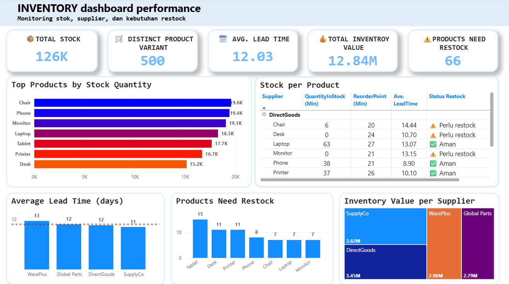

# inventory-dashboard-powerbi
# 📊 Inventory Dashboard Performance – Power BI

Dashboard ini dibuat menggunakan Power BI untuk memantau performa persediaan barang berdasarkan stok, supplier, lead time, dan kebutuhan restock. Cocok untuk digunakan oleh tim procurement, warehouse, maupun manajemen dalam proses pengambilan keputusan.

---

## 🎯 Tujuan Dashboard

- Monitoring jumlah stok secara keseluruhan
- Mengetahui produk-produk yang membutuhkan restock
- Menganalisis distribusi stok berdasarkan supplier dan produk
- Menghitung lead time rata-rata antar supplier
- Mengetahui nilai inventaris per supplier

---

## 📁 Dataset
Dataset yang digunakan dapat diunduh di: [The Spreadsheet Guru – Sample Data](https://excelx.com/practice-data/sales-retail/).
Dataset terdiri dari kolom utama:

- `ProductID`
- `ProductName`
- `QuantityInStock`
- `ReorderPoint`
- `Supplier`
- `SupplierContact`
- `LeadTime`
- `StorageLocation`
- `UnitCost`

---

## 📊 Komponen Visualisasi

- **KPI Cards**: Total Stock, Distinct Product Variant, Average Lead Time, Total Inventory Value, Products Need Restock
- **Bar Chart**: Top Products by Stock Quantity
- **Table**: Detail Stok per Produk
- **Column Chart**: Average Lead Time per Supplier dan Products Need Restock
- **Treemap**: Inventory Value per Supplier

---

## 🆔 ℹ️ Tentang "Distinct Product Variant"

Angka ini merepresentasikan jumlah **produk unik berdasarkan ID**, yang mungkin memiliki **nama produk yang sama** (misalnya "Laptop") namun berbeda dalam hal:
- Supplier
- SKU
- Spesifikasi tertentu
- Harga atau lead time

Contohnya, jika ada 3 supplier menyediakan produk bernama "Laptop", maka ketiganya akan dihitung sebagai 3 produk unik karena memiliki ID yang berbeda.

---

## 🖱️ Tooltip Interaktif

Untuk meningkatkan pemahaman pengguna terhadap setiap metrik utama (KPI), digunakan fitur **tooltip dinamis** di Power BI.

### Cara Membuat Tooltip di Power BI:

1. **Buat halaman baru**, aktifkan opsi `Tooltip` di Page Information.
2. Atur ukuran halaman menjadi `Tooltip` atau `Custom` via `Canvas settings`.
3. Tambahkan konten informatif seperti teks, card, atau visual mini.
4. Kembali ke dashboard utama, pilih visual yang ingin diberi tooltip (contoh: card “Distinct Product Variant”).
5. Aktifkan Tooltip > Type: `Report Page` > Page: pilih halaman tooltip yang sudah dibuat.

Tooltip ini akan muncul saat pengguna mengarahkan kursor ke visual yang ditentukan, memberikan informasi tambahan secara langsung tanpa mengganggu layout dashboard utama.

---

## 🛠 Tools

- **Power BI Desktop** – untuk visualisasi dan modeling
- **Microsoft Excel** – untuk persiapan dan pembersihan data
- **DAX (Data Analysis Expressions)** – digunakan untuk calculated columns & measures, seperti:
  - `Total Inventory Value = sumx(Sheet1,Sheet1[QuantityInStock]*Sheet1[UnitCost])`
  - `Products Need Restock = CALCULATE(COUNTROWS(Sheet1),Sheet1[QuantityInStock] < Sheet1[ReorderPoint])`
  - `Distinct Product Varian = DISTINCTCOUNT(ProductID)`

---

## 📌 Insight yang Didapat dari Dashboard

- 🔻 **66 produk memerlukan restock**, ditampilkan dalam bar chart "Products Need Restock". Produk seperti Tablet, Desk, dan Printer termasuk yang paling mendesak untuk diisi ulang.
  
- 🧭 **Lead time tertinggi** berasal dari supplier seperti WarePlus, yang dapat memperlambat proses restock dan meningkatkan risiko kehabisan stok.

- 📦 **Produk dengan stok tertinggi** seperti Chair, Phone, dan Monitor, terlihat mendominasi inventaris — berguna untuk mengelola ruang gudang dan rotasi barang.

- 💰 **Inventory value per supplier** menunjukkan bahwa SupplyCo menyumbang nilai inventaris terbesar (3.62M), disusul oleh DirectGoods dan WarePlus.

- ⚠️ **Item penting dengan stok rendah** ditandai melalui visual kombinasi reorder point & quantity — membantu tim procurement segera bertindak.

- 📊 **Rata-rata lead time** berada di kisaran 12 hari — insight ini penting untuk menyusun ulang jadwal pemesanan (reordering schedule).

---

## 📬 Kontak

Jika ada pertanyaan atau masukan, silakan hubungi melalui Issues atau Pull Request.
